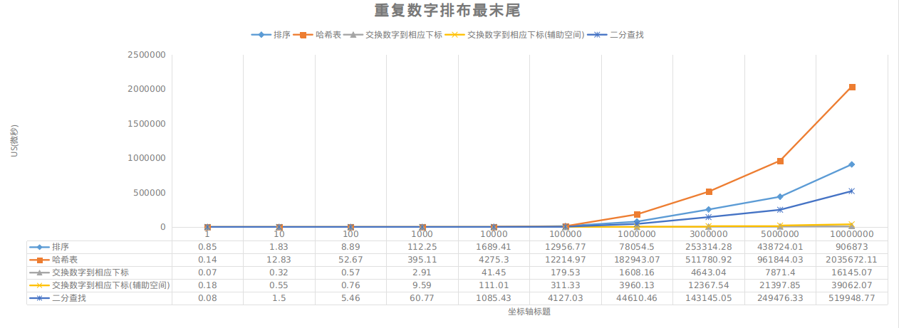
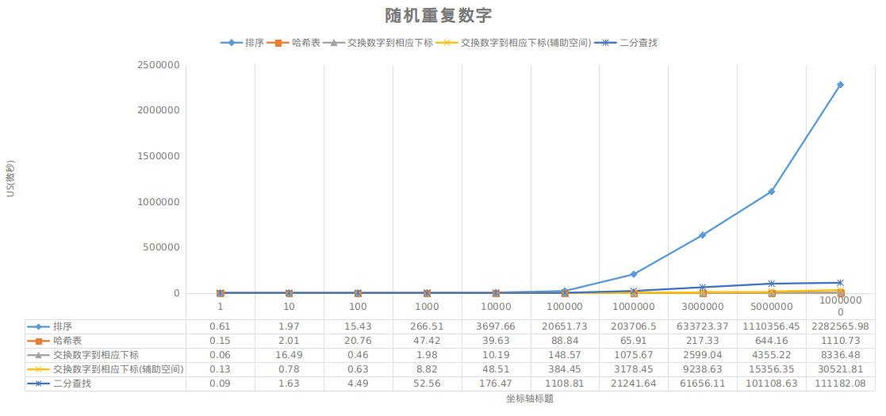

<!-- TOC -->

- [1. 说明](#1-说明)
- [2. 解题思路](#2-解题思路)
- [3. 相关资料](#3-相关资料)
- [4. 测试用例](#4-测试用例)
- [5. benchmark](#5-benchmark)

<!-- /TOC -->

<a id="markdown-1-说明" name="1-说明"></a>
# 1. 说明

参考:  
剑指offer - 面试题3 数组中重复的数字

<a id="markdown-2-解题思路" name="2-解题思路"></a>
# 2. 解题思路

在数组中判断是否有任一数字重复

解题方法|时间复杂度|空间复杂度|修改数组|限制
-|-|-|-|-
排序|O(nlogn)|O(1)|是|无
哈希表|O(n)|O(n)|否|无
交换数字到相应下标|O(n)|O(1)|是|长度为n所有数字都在0~n-1范围之内


书上面我个人不推崇的:
解题方法|时间复杂度|空间复杂度|修改数组|限制
-|-|-|-|-
交换数字到相应下标(辅助空间)|O(n)|O(n)|否|长度为n所有数字都在0~n-1范围之内
二分查找|O(nlogn)|O(1)|否|长度为n所有数字都在0~n-1范围之内

<a id="markdown-3-相关资料" name="3-相关资料"></a>
# 3. 相关资料
* https://www.zhihu.com/question/36132386/answer/155438728 (二分查找有几种写法)


<a id="markdown-4-测试用例" name="4-测试用例"></a>
# 4. 测试用例

* 包含一个重复的数字(前部,中部,后部)
* 包含多个重复的数字
* 不包含重复的数字
* 一个数字
* 长度为n的数组中不包含0~n-1的数字

<a id="markdown-5-benchmark" name="5-benchmark"></a>
# 5. benchmark

测试问题: 长度为n所有数字都在0~n-1范围之内,要求:任意一个重复的数字

变量控制 
* 数字的个数
* 数字随机排布
* 数字排布最末尾

观测指标: 
* 时间消耗
* 内存消耗

测试:
```bash
go build repeat_number.go

# 重复数字排布最末尾
for i in 1 10 100 1000 10000 100000 1000000 3000000 5000000 10000000; do
  taskset -c 1 ./repeat_number $i
  sleep 1
done

# 重复数字随机排布
for i in 1 10 100 1000 10000 100000 1000000 3000000 5000000 10000000; do
  taskset -c 1 ./repeat_number $i --rand
  sleep 1
done
```





数据看上去很奇怪,其实并不奇怪的.因为第一个图片的测试数据是排序好了的.

在随机数据下,哈希表找重复数字是不二之选!
