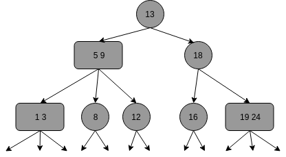

<!-- TOC -->

- [1. 说明](#1-说明)

<!-- /TOC -->

# 1. 说明

> `2-结点`, 含有一个键和两条链接,左链接的键都小于该节点,右链接的键都大于该结点  
> `3-结点`, 含有两个键和三条链接,左链接的键都小于该结点,中链接的键位于结点的两个键中间,右链接都大于该结点  
> 一颗完美平衡的2-3查找树中的所有空链接到根结点的距离都应该是相同的

> 我们需要维护两种不同类型的结点,将被查找的键和结点转换到另一种数据类型,等等.实现这些不仅需要大量的代码,`而他们所产生的额外的开销可能会使算法比标准的二叉查找树更慢`  
> 幸运的是,我们只需要一点点代价就能用一种同意的方式完成所有变换 -> 红黑树

