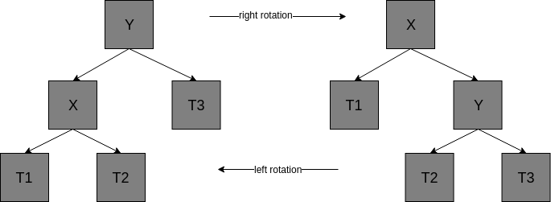
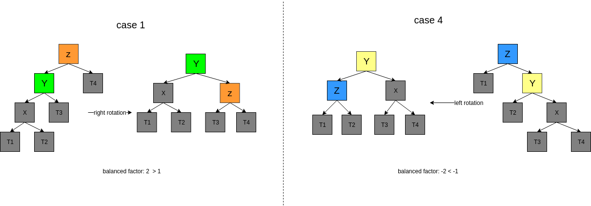
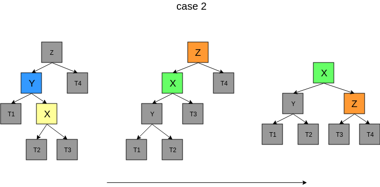
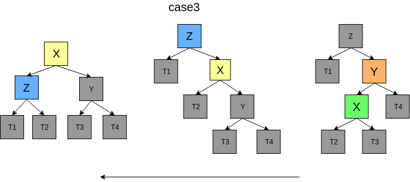

<!-- TOC -->

- [1. 说明](#1-说明)
- [2. 旋转](#2-旋转)

<!-- /TOC -->

# 1. 说明

文档:
* https://www.jianshu.com/p/65c90aa1236d (还不错啦)
* https://zh.wikipedia.org/wiki/AVL%E6%A0%91
* https://stackoverflow.com/questions/2603692/what-is-the-difference-between-tree-depth-and-height
* https://stackoverflow.com/questions/3955680/how-to-check-if-my-avl-tree-implementation-is-correct (测试用例验证正确性,稍微参考下把,其实不太好)

> AVL树是最先发明的自平衡二叉查找树.在AVL树中任何结点的两个子树的高度最大差距为1,所以也被成为高度平衡树.查找,插入和删除在平均和最坏情况下都是O(logn)

平衡因子:
> 某个结点的平衡因子等于该结点的左孩子的高度减去右孩子的高度, 如果平衡因子为0,1,-1这三个数的话,可以定义该结点符合平衡树的定义

实现:
* 插入
* 删除
* 查找

# 2. 旋转

case2:
* 先对`Y`结点做`左`旋转,再`Z`结点做`右`旋转

case3:
* 先对`Y`结点`右`旋转,再对`Z`结点`左`旋转

