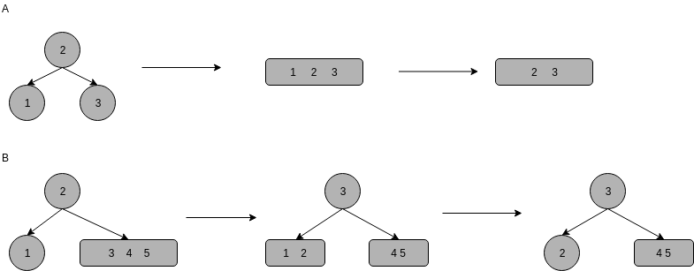
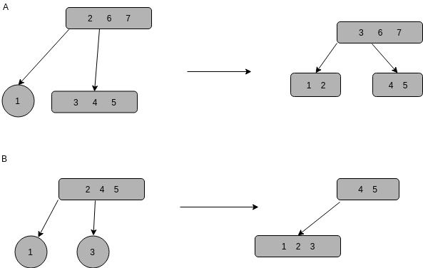

<!-- TOC -->

- [1. 说明](#1-说明)
- [2. 旋转](#2-旋转)
- [3. 插入(2-3)](#3-插入2-3)
- [4. 插入(2-3-4)](#4-插入2-3-4)
- [5. 删除(2-3-4)](#5-删除2-3-4)

<!-- /TOC -->

# 1. 说明

* http://www.360doc.com/content/17/0912/19/46290389_686574425.shtml (2-3-4简单了解下)
* https://www.cs.usfca.edu/~galles/visualization/RedBlack.html (动画)

> 红黑二叉查找树背后的基本思想是用标准的二叉查找树(完全由2-结点构成)和一些额外的信息(替换3-结点)来表示2-3树  
> `红链接`将`两个2-结点`连接起来构成`一个3-结点`  
> `黑链接`则是2-3树中的`普通链接`

> 红链接`均为左链接`
> `没有`任何一个结点`同时和两条红链接`相连  
> `完美黑色平衡的`,任意空链接到根结点的路径上的黑链接的数量相同  

> 优点: 能够将两个算法的优点结合起来: 二叉查找树中简洁高效的查找方法和2-3树中高效的平衡插入算法

一一对应关系:  

实现:
* 插入
* 删除
* 查找

# 2. 旋转

# 3. 插入(2-3)
> 注意: 根节点总是黑颜色

case1: 向单个2-结点插入新键   

case2: 向树底部的2-结点插入新键 (其实和case1一致)

case3: 向单个3-结点插入新键 

case4: 向树底部的3-结点插入新键 (其实和case3一致)  

 

 总结下来:

 * 右结点红 && 左结点黑 -> 左转
 * 左结点红 && 左结点的左结点红 -> 右转
 * 左结点红 && 右结点红 -> 颜色转换

# 4. 插入(2-3-4)

# 5. 删除(2-3-4)

case1-底部的3-结点中删除键 -> 很简单  

case2-底部的2-结点删除键->会留下空结点,不能直接删除

所以需要沿着左链接向下进行变换,确保结点不是2-结点
* 如果`根是2-结点`并且`两个子结点都是2-结点`,直接将`3个结点`变成`一个4-结点`. 如图中A
* 保证根结点的`左子结点不是2-结点`,(可以从右侧的兄弟结点借来一个键). 如图中B

other-leftdecline-左链接向下,保证:
* 当前结点的左子结点不是2-结点,完成
* 当前结点的`左子结点是2-结点`,并且`兄弟结点不是2-结点`,将兄弟结点的一个键移动到左子结点中. 如图中A
* 当前结点的左子结点和它的亲兄弟结点`都是2-结点`,将它们和父结点中的最小键`组合为一个4-结点`,父节由 (3-) -> (2-) 或 (4-) -> (3-). 如图中B

