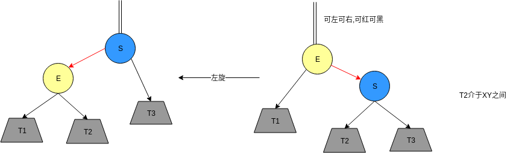
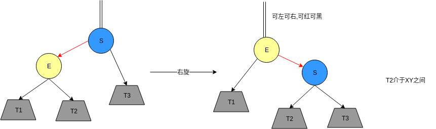

<!-- TOC -->

- [1. 说明](#1-说明)
- [2. 旋转](#2-旋转)
- [插入](#插入)

<!-- /TOC -->

# 1. 说明

> 红黑二叉查找树背后的基本思想是用标准的二叉查找树(完全由2-结点构成)和一些额外的信息(替换3-结点)来表示2-3树  
> `红链接`将`两个2-结点`连接起来构成`一个3-结点`  
> `黑链接`则是2-3树中的`普通链接`

> 红链接均为左链接  
> `没有`任何一个结点`同时和两条红链接`相连  
> 完美黑色平衡的,任意空链接到根结点的路径上的黑链接的数量相同  

> 优点: 能够将两个算法的优点结合起来: 二叉查找树中简洁高效的查找方法和2-3树中高效的平衡插入算法

一一对应关系:  

实现:
* 插入
* 删除
* 查找

# 2. 旋转

# 插入
> 注意: 根节点总是黑颜色

* case1: 向单个2-结点插入新键   

* case2: 向树底部的2-结点插入新键 (其实和case1一致)

* case3: 向单个3-结点插入新键 

* case4: 向树底部的3-结点插入新键 (其实和case3一致)  

 

 总结下来:

 * 右结点红 && 左结点黑 -> 左转
 * 左结点红 && 左结点的左结点红 -> 右转
 * 左结点红 && 右结点红 -> 颜色转换

 