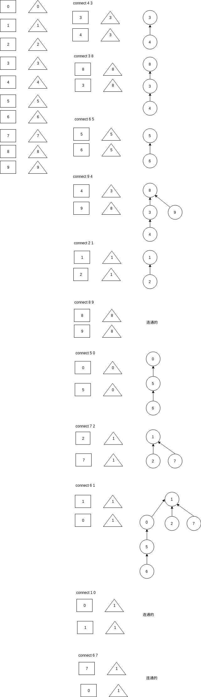

<!-- TOC -->

- [1. 用树来处理并查集的核心思路](#1-用树来处理并查集的核心思路)

<!-- /TOC -->

<a id="markdown-1-用树来处理并查集的核心思路" name="1-用树来处理并查集的核心思路"></a>
# 1. 用树来处理并查集的核心思路


```bash
10
4 3
3 8
6 5
9 4
2 1
8 9
5 0
7 2
6 1
1 0
6 7
```

```go
// p: 下标
// qu.id[p]: 下标内的数值 (连接到的下标)
func (qu *QuickUnion) Find(p int) int {
	for p != qu.id[p] {
		p = qu.id[p]
	}
	return p
}
```




从上图可得知两个关键的点:

* 正方形: 下标,含义是数值
* 三角形: 下标内的内容,含义是连接到的点

连接时注意:

* 用最深处的节点去连接最深处的节点

